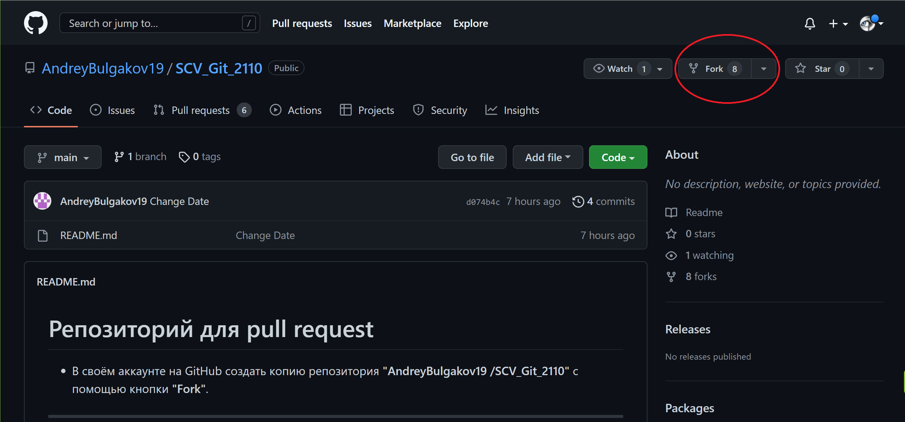

# Работа с Git

## 1. Проверка наличия установленного Git 
В терминале выполнить команду 
```
git version
```


Если Git установлен, будет сообщение с информацией о версии программы.
Иначе будет сообщение об ошибке.

## 2. Установка Git
Загружаем последнюю версию Git c сайта 
https://git-scm.com/downloads 
устанавливаем с настройками по умолчанию.

## 3. Запуск Git 
Если вы работаете под управление ОС Windows , Вам необходимо запустить Git Bash. На других платформах запустите терминал.
## 4. Настройка Git 
При первом использовании Git необходимо представится. Для это необходимо ввести в терминале 2 команды : 
```
git config --global user.name "Имя пользователя"
git config --global user.email "почта@почта.com"
```
Для того, чтобы посмотреть все настройки системы, используйте команду:
```
git config --list
```
## 5. Создание репозитория, файла и дальнейшее отслеживания
Для этого создайте папку вашего проекта, введя в терминале команду
```
mkdir Имя папки
```

### 5.1. Инициализация репозитория
Чтобы создать новый репозиторий, нам нужно открыть, зайти в папку нашего проекта и выполнить команду
```
git init
```
2. Клонировать существующий репозиторий Git из любого места. Сделать это можно так:
   
```
Git clone <адрес репозитория>
```
Каждый файл в рабочей папке(репозитории) может находиться в одном из двух состояний: под версионным контролем (отслеживаемы) и нет (не отслеживаемые).

### 5.2. Определения состояния 
status — важнейшая команда, которая показывает информацию о текущем состоянии репозитория
```
git status
```
### 5.3. Создания файла для отслеживания
Выполните данную команду в терминале для создания нового файла
```
touch имя файла.Расширение
```


### 5.4. Отслеживание изменений проекта
```
git add имя файла.Расширение 
```

* Добавление commit (Обязательно добавляем комментарий не забывая про кавычки)
```
git commit -m "<комментарий>"
```

Отслеживаемые файлы могут быть неизмененными , или измененными или подготовленными к коммиту.

## 6. Просмотр коммитов
Введите в терминале команду 
```
git log
```
Данная команда перечисляет коммиты с из хеш-кодами, именем и электронной почтой автора, датой создания и сообщением коммита.

Терминал может выдать большое количество информации где в конце будет написано [END] и может показаться что терминал "повис", Вам необходимо нажать кнопку q.


```
git log --oneline
```
Например:


Покажет только 2 последних коммита
```
git log --oneline -2
```
## 7.Просмотр изменений
Информацию по изменениям можно вывести на экран с помощью команды 
```
git diff
```

## 8. Навигация внутри изменений .
Для перехода по веткам изменений необходимо ввести команду в терминале 
```
git checkout и буквенно-цифровое имя коммита
```
имя коммита Вы можете увидеть выполнив пункт 6 . 

команда которая вернет Вас к последней , самой новой и актуальной версии вашего проекта.
```
git checkout master 
```

Ну вот собственно и всё что потребуется Вам для начальной работы и общения с Git помощником .

# 9.Ветвление (branch)

### 9.1 Создание и перемещение по веткам 
Чаще всего при создании новой ветки git пользователю необходимо сразу же переключиться на нее. В таком случае стоит использовать:

```
 git checkout branch <name of new branch> 
 или 
 git checkout -b <name of new branch>
```
Это будет равносильно двум командам:

```
 git branch <name of new branch>
 git checkout <name of new branch>
 ```

Эта команда может немного больше, чем просто создавать ветки из текущей. Если запустить ее без параметров:
```
git branch
```
При выполнении этой строки мы получим список существующих веток, где символом * будет отмечена ветка, где вы сейчас находитесь. Это может выглядеть так:


После создания новой ветки, перехода в нее и совершения всех запланированных преобразований, нужно сделать коммит в эту же ветку, чтобы сохранить все изменения. Команды для выполнения этих действий ничем не отличаются от команд для создания коммитов в ветке мастер.

### 9.2 Удаление веток. Здесь нужно действовать осторожно. С операцией удаления над ветками справляется уже привычная команда git branch с параметром -d:

```
 git branch -d <name of branch>
```
Для корректного удаления нужно помнить несколько правил, чтобы не получить ошибки:

* Нельзя удалить ветку, в которой вы находитесь. Git выкинет ошибку и не произведет удаление. Следовательно, нужно перейти на другую ветку.
* Git не позволит удалить ветку, у которой есть несохраненные изменения. Так мы избегаем ситуации, когда часть написанного кода будет безвозвратно утеряна. 
* Если же мы уверены, что изменения в этой версии не нужны и их можно смело удалять, то вместо флага -d используем -D:
```
 git branch -D <name of branch>
```

### 9.3 Слияние веток 
в Git предусмотрено слияние — перенос изменений с одной ветки на другую. Однако сливаемая ветка (под этим определением мы подразумеваем ветку, у которой берем изменения для «вливания» их в другую ветвь) никак не меняется и остается в прежнем состоянии. Такие преобразования мы получаем, применив git merge:
```
 git merge <name of merged branch>
 ```
 При попытке некорректного слияния Git останавливает выполнение команды, чтобы вы могли разрешить конфликт.
 
**Решить конфликт можно двумя способами:**

* Вручную разрешить файловый конфликт. Для этого нужно самим изменить файлы, с которыми возникли проблемы. Мы получим файлы такими, какими и представляли их при попытке слияния.
* Выбрать более подходящий файл, а от второго отказаться.

### 9.4 Отображение журнала фиксации в виде графика для текущей или всех веток

Просмотреть историю коммитов в виде графика для текущей ветки можно с помощью параметра log и флагов 
* --graph 
* --oneline
*  --decorate. 
  
  Опция --graph выведет график в формате ASCII, отражающий структуру ветвления истории коммитов. В связке с флагами --oneline и --decorate, этот флаг упрощает понимание того, к какой ветке относится каждый коммит.
```
git log --graph --oneline --decorate
```
Для просмотра истории коммитов по всем веткам используется флаг --all.
```
git log --all --graph --oneline --decorate
```
Пример веток и их слияний 

## 10 Игнорирование файлов и каталогов с помощью файла .gitignore

* Вы можете заставить Git игнорировать определенные файлы и каталоги, то есть исключить их от отслеживания Git - **путем создания одного или нескольких файлов .gitignore в вашем репозитории.**
- Записи в файле .gitignore могут включать имена или пути, указывающие на:
1. временные ресурсы, например, кэши, файлы журналов, скомпилированный код и т. д.
2. файлы локальной конфигурации, которые не должны использоваться совместно с другими разработчиками
3. файлы, содержащие секретную информацию, такие как пароли входа, ключи и учетные данные

* Когда файл или каталог игнорируются, это не будет:

1. отслеживается Git
2. сообщается командами, такими как git status или git diff
3. с такими командами, как git add -A

### 10.1 Исключения в файле .gitignore
Если вы игнорируете файлы с помощью шаблона, но имеете исключения, префикс восклицательного знака (!) К исключению. Например:
```
*.txt
!important.txt
```
В приведенном выше примере Git игнорирует все файлы с расширением .txt за исключением файлов с именем important.txt 

# 11. Работа с удаленным рипозитарием
 Прежде чем работать с удаленными репозитариями Вам необходимо зарегестрироваться на сайте _GitHub_ :  https://github.com/ , где пройдя стандартную регистрацию, Вы сможете создать удаленный репозитарий. Выбрав при этом будет он публичным(общественным), или приватным(вы сами решите кому давать доступ) 

### 11.1 Просмотр удалённых репозиториев
Для того, чтобы просмотреть список настроенных удалённых репозиториев, вы можете запустить команду 
```
git remote
```
Если у вас уже есть удаленный репозитарий то Вы увидите как минимум origin — имя по умолчанию, которое Git даёт серверу, к которому вы привязались.

Вы можете также указать ключ -v, чтобы просмотреть адреса для чтения и записи, привязанные к репозиторию:
```
git remote -v 
```
Например: 


### 11.2 Добавление удалённых репозиториев
 Для того, чтобы добавить удалённый репозиторий, просто выполните команду
 ```
  git remote add <имя репозитария(по умолчанию origin)> <url>
  ```
  _url_ необходимо взять с GitHub или другова сервера.
### 11.3 Отправка изменений в удаленный репозиторий (Push)
Когда вы хотите поделиться своими наработками, вам необходимо отправить их в удалённый репозиторий. Команда для этого действия простая:
```
 git push <remote-name> <branch-name>
 ```
 ### 11.4 (__PULL__) Извлечения и загрузки содержимого из удаленного репозитория и немедленного обновления локального репозитория этим содержимым.
Команда используется для cлияние удаленных вышестоящих изменений в локальный репозиторий 
```
git pull
``` 

### 11.5 Создание форка репозитория на GitHub. Пулл-реквесты.
Итак, одной из самых важных частей GitHub является создание форков.

1. _Форк (от англ. fork – вилка) – точная копия репозитория, но в вашем аккаунте. Форки нужны, чтобы вносить свои изменения в проект, к репозиторию которого у вас нет прямого доступа._

2. __Пулл-реквест (от англ. pull-request – запрос pull) – функция GitHub, позволяющая попросить владельца репозитория, от которого мы сделали форк, загрузить наши изменения обратно в свой репозиторий.__

* Если коротко, форки и пулл-реквесты нужны, чтобы любой пользователь мог внести свой вклад в любой открытый проект, репозиторий которого есть на GitHub. Кроме того, перед тем как влить ваши изменения в основной репозиторий, ответственные обязательно проверят ваш код на наличие ошибок и уязвимостей. Таким образом, даже если ваши изменения не примут, вы получите первоклассный code-review с указанием всех неточностей.

#### 1. Для начала зайдем на страницу репозитория проекта. Нажимаем на кнопку Fork, как показано на картинке. После этого Git создаст точную копию этого репозитория в вашем аккаунте.


#### 2. Клонируем репозиторий к себе на компьютер командой 
```
git clone <URL удаленного репозитория>
```

#### 3. 
* ___Предварительно необходимо создать новую ветку, так как работать и изменять основную ветку не принято в мире программистов!___
* Проводим работу, изменения, делаем коммиты
* Затем выполним ```git push```, чтобы загрузить наши изменения в удаленный репозиторий.

#### 4. Скорее всего Git несможет выполнить даную команду так как такой ветки не откажется на удаленном репозитории и предложит Вам выполнить следующую:
```
git push --set-upstream origin <имя новой ветки в которой Вы делали изменения>
```


## 11. Полезные команды терминала
В ходе работы с Git будут так же полезны терминальные команды 
```
ls - список папок и файлов.
ls -a показать список скрытых файлов.
cd Имя папки - заход в папку. 
mkdir Имя папки - создаст папку. 
touch Имя файла - создаст файл.
rm имя файла - полное удаление файла без возможности восстановления.
rm -R имя папки - полное удаление папки и все что внутри
```
